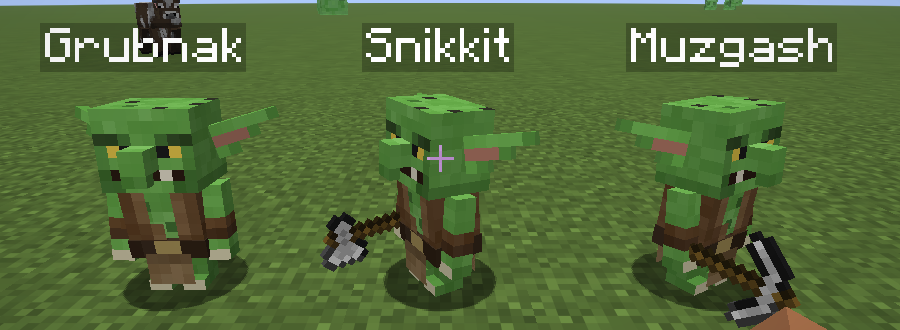

# Goblin Labour


Fabric mod for Minecraft 26.2. Craft goblins out of rotten flesh, give each one a straw bed and some tools, and let them mine, dig and chop for you while you do something more interesting.

Inspired by [Minions Remastered](https://github.com/BrassAmber-Mods/MinecarftMinionsRemastered) (LGPL-2.1): the job loop, the spiral stair and the "blink" fallback follow its design. Code, goblin model and textures are this mod's own.

**Status: early development, playable.** Items, beds, goblins, inventory, jobs (mine down with stairs, mine ahead, chop, farm, collect), goblin chests and the home zone are in. Furniture bonuses and polish are next.



## How it works

1. **Goblin Meat Pack**: nine rotten flesh, shapeless.
2. **Goblin Blank**: smelt (or smoke) the meat pack.
3. **Goblin Straw Bed**: six hay bales, the lower two rows of the crafting grid.
4. Right-click the bed with a blank: a goblin with a random name appears and is bound to that bed.
5. **Goblin Ring**: a gold ingot in each corner, a diamond in the top middle, three blanks in the middle left, middle right and bottom middle.
6. **Goblin Chest**: a chest and a meat pack, shapeless. Mossy green under dark iron bands, with bone horns on the lid and a green eye on the lock plate; when it opens the lid turns out to be a jaw full of teeth. Two of them next to each other make a double chest with a bigger set of horns. A dye paints it in any of the sixteen colours (the chest plus the dye, shapeless), from any colour to any other; green dye makes it plain again. Only chests of one colour join into a double chest, and goblins unload into all of them.
7. **Milk Can**: iron, glass, iron / iron, bucket, iron / three iron. An old grey milk can with two handles that holds ten buckets of milk. The milk shows at the rim: a drip running over it, then milk up to the rim, then milk running down the sides, and a full can has its lid on. A broken can keeps its milk (the item shows how much). Right-click with a milk bucket to pour it in, with an empty bucket to fill it; an empty hand opens its screen, shaped like the can in dark grey metal: the bucket slot above the output slot and the gauge beside them, with a line for every bucket. Hoppers put buckets in from the top and the sides and take them out below; a comparator reads the level.
8. **Milk Can Expansion**: eight iron around a bucket. A full block tank in the milk can's metal that holds twenty buckets. A Milk Can standing on it pours its milk down into it, two buckets a second. Its milk is a fluid (`goblinlabour:milk`, tagged `c:milk`) in Fabric's transfer API, so pipes and storage mods such as Refined Storage importers take it out, or put it in, from every side. Otherwise it works like the can: right-click with a bucket, an empty hand opens the same screen without the can's neck and handles (the gauge has a line for every bucket), hoppers put buckets in from the top and the sides and take them out below, a comparator reads the level, and a broken one keeps its milk.

Every bed has a **home**: 5 blocks in every horizontal direction and 2 up and down. Goblins never mine inside a home, and goblin chests placed in a home are where they unload. Homes of several beds that touch each other merge into one flat. Hold a **Goblin Head** (blank + torch) to see the home borders as floating emeralds.

Breaking a bed sends its goblin back into a blank that keeps the goblin's name and tools. Goblins have 20 health, cannot be targeted by monsters and do not fight. Lava, drowning and falls still kill them; a dead goblin respawns on its bed after five seconds with its tools, the rest of its inventory is dropped where it died.

A goblin's skin shows its trade: lumberjacks (Chop) are green, farmers yellowish, miners (staff orders) greyish, collectors (Collect) bluish and carry a small leather backpack. Resting keeps the last colour. On top of that every goblin has one of four looks, picked by its name so it survives death and blanks: plain leather vest and tusks; patched vest, gold earrings, a scar and a notched ear; sackcloth tunic, bandage, nose ring and a taller skull; fur collar, bone necklace, a single fang and a topknot with a braid. Textures come from `tools/MakeGoblinTexture.java`.

The bed shows the trade too: while its goblin works, something lies under the frame (an axe, logs or sticks for lumberjacks; wheat, vegetables, a hay bale or a hoe for farmers; diamonds, emeralds, redstone or a chunk of ore for miners; bundles or a small barrel for collectors). The items are half a pixel thick, extruded like held items, and peek out at the foot end so you can see them while standing. Each bed picks one of four arrangements; a resting goblin's bed is empty underneath. Bed models come from `tools/MakeBedModels.java`.

Goblins talk in chat, in English, server-wide: when they start, get picked or ordered with the staff ("Yes, master!"), finish a job, come back from the dead, run out of storage, or cannot find a way out of their home. While working they chatter now and then ("Working, working, working!", "I love my job!"). They also have voices: pitched-up villager and witch sounds defined in `sounds.json`, so a resource pack can replace them.

The **Goblin Handbook** (book + rotten flesh) explains all of this in game, in English and German, in its own screen: chapter tabs for Basics, Jobs, the Staff, the Goblin Ring and Farming, item icons beside each explanation, recipes as icons with an arrow, names in gold and warnings in red. The book turns its pages itself, so a text can be as long as it needs to be.

## Working

- **Right-click a goblin**: a player-style inventory titled with its name and trade ("Grubnak the Lumberjack"). Tools go into the bottom row; goblins only use tools they carry. Without a pickaxe they cannot break stone, without diamond no obsidian (vanilla rules). Tools do not wear out.
- **Right-click the bed**: Rest, Chop, Farm or Collect, the radius and (for Chop) replanting on or off.
  - *Rest*: potter about the home (about nine tenths of the time) and take a short nap in bed now and then (heals fast in bed, slowly while awake). Pottering works like a vanilla mob's stroll: a short walk, then a pause of a few seconds looking around or at a player or goblin nearby. A goblin outside its home walks straight back.
  - *Chop*: fell the trees within the radius one at a time. A goblin claims the tree nearest to it (every log connected to it, branches included) and takes it down from the lowest log up before it moves on; other lumberjacks leave a claimed tree alone, and the goblin keeps its tree until the last log is down, waiting for logs it cannot reach yet instead of leaving them to another goblin (a tree that loses no log for five minutes is given up). It picks up the logs and what the crowns drop (saplings, sticks, apples). With *Replant saplings* on (the default, a switch in the bed menu) the stumps of a felled tree get a sapling, the tree's own kind first, from the saplings it picked up under the tree or else from its tool row. Saplings put into the tool row are planted out on free ground inside the radius (never in a home): no tree, leaf or sapling closer than 3 blocks, ideally 4 to 5 blocks apart. Everything in the storage, saplings included, goes into the chests when it unloads. Leaves in the way are cleared: when the only way to a log leads through leaves (jungle bushes, a low crown), the goblin breaks the leaves on that way first, like a player hacking a path. High logs are reached by climbing: the goblin puts a **Goblin Scaffold** block into the block it stands in and climbs it like a player holding jump on scaffolding, one block at a time, breaking leaves in the way, and sneaks back down through the column.
  - *Farm*: a farmer does whatever its tool row has the tools for, within the radius and never in a home, the nearest thing first. Tools never wear out.
    - **Hoe**: harvest ripe crops, nether wart, pumpkins, melons and wart blocks and replant them with a seed from the drops (or the inventory); harvest ripe cocoa and replant the pod on the same side of the log; pick sweet berries (the bush keeps growing) and glow berries; cut sugar cane, bamboo and cactus down to the bottom block. With cocoa beans in the tool row it also plants cocoa on free sides of jungle logs. Harvesting needs the hoe: a farmer without one leaves ripe crops standing and asks for a hoe.
    - **Bucket**: milk grown cows, each cow once every five minutes. At home the milk goes into a **Milk Can** (the bucket is used up), what does not fit goes into the goblin chest.
    - **Shears**: shear sheep; the wool is picked up and unloaded.
    - **Treetap** (Tech Reborn): tap rubber logs with sap; the sap is picked up and unloaded.
  - *Collect*: pick up loose items within the radius (the home included) and bring them to the goblin chests. Collectors carry a backpack: a second storage row, twice as much loot per trip.
- **Goblin Scaffold** is vanilla scaffolding with its own block (stand on it, climb inside it, sneak to drop through; every block needs support within seven blocks, so breaking the foot of a column brings the whole column down), has a brown texture, is not craftable and drops nothing. Goblins never break it; a column vanishes two minutes after a goblin last touched it, so any goblin can use a column another one built.
- A goblin that wants to go home (resting or unloading) but gets no closer to it, stuck in a hole it cannot walk out of like a shaft dug without stairs, climbs out on scaffold. (Goblins shoving each other in a hole never stand still, so it is the lack of headway towards the bed that counts, not standing still.) It picks the cheapest column at the side of the hole; an existing column costs nothing, so the next goblin in the same hole uses the first one's scaffold. Only one goblin climbs a column at a time: the others wait a couple of blocks aside and follow one after the other, and a climbing goblin cannot be pushed off its column. With no way up at all it blinks home.
- **Goblin Staff** (blank + two sticks): left-click goblins to pick them, they glow and follow you. Right-click a block to send all picked goblins to work at once: the floor starts a 3x3 shaft with stairs down to bedrock, a ceiling a 3x3 shaft up to the surface (it starts on the floor below the clicked ceiling: the air between floor and ceiling gets its stair steps too, so the stairs reach the ground), a wall a 3x3 tunnel two chunks deep. Sneak + right-click opens the settings first: 1x1, 3x3 or 5x5, stairs on or off, target height, tunnel width, height and length. A tunnel 2 or more high starts one block below the block you click, so looking straight ahead at a wall gives a tunnel on the ground you stand on; height 1 digs only the clicked row. Several goblins share one shaft or tunnel; a shaft that overlaps another goblin's is refused. Stair steps are placed one by one after each layer is dug.
- **Goblin Ring** (gold, a diamond and three blanks): right-click calls a personal mining crew of three goblins for five minutes; right-click again sends it home early. Crew goblins are miners with a diamond pickaxe, shovel and axe and belong to no bed; they wear blue-grey clothes, so they are easy to tell from the goblins that sleep in your beds.
  - They stay within about 8 blocks of you (a staff order aside, see below): a goblin further away walks back, one far off (or stuck) blinks back. They keep out of your way: out of your personal space and out of the lane you look or walk along, and your clicks and arrows pass through them. With nothing to do they stroll about near you and look around, each to a spot of its own, so they do not walk into each other.
  - They mine the ores around you that they can see (from a spot in reach with a clear view; never inside a home, never the block you are looking at). Once they start on an ore they take out its whole vein, ores hidden in the rock included (up to 64 blocks), before they turn to any other ore; a vein whose last ores are walled in by stone is given up after half a minute.
  - When you dig natural ground yourself (stone, deepslate, dirt, sand, gravel and the like: the block tag `#goblinlabour:natural`, which a datapack can change; a placed block cannot be told from a generated one), they help around the block you broke for 20 seconds: never below your feet, so nobody's floor is dug away, never the block you are looking at, never inside a home.
  - They pick up loose items nearby, including what a player threw — what you threw yourself is left alone for three seconds so you can take it back.
  - They have no inventory of their own and theirs cannot be opened: everything goes into the ring, which holds a double chest. Sneak + right-click opens it, in the goblin look: the loot, and a side panel with a crew goblin's portrait and two slots for enchanted books. The books' enchantments go onto the crew's diamond pickaxe, shovel and axe (each enchantment onto every tool it fits, the higher level where both books have it) as soon as a book goes in or out: Efficiency makes the crew dig faster, Fortune and Silk Touch change what the ores drop. When a goblin chest is within 16 blocks, one goblin at a time carries the ring's contents over, a stack at a time; a carrier is the only one allowed that far off the leash.
  - The **Goblin Staff** works on the crew too, for the ring's owner only: with the staff in hand the crew goblins can be clicked (otherwise clicks pass through them), picked and sent to dig a shaft or tunnel like bed goblins (same stairs and scaffold). A crew goblin picked while it works on an order stops, follows you, and goes back to the order when you let go of it. The loot goes into the ring. An order takes them off the leash until it is done: they dig the whole shaft or tunnel wherever it leads, however far that is from you, and only go back to your side once it is finished. You do not have to follow them in. While on an order they may work in the lane you look along, but still keep out of your personal space and your walking path.
  - The crew leaves when its time is up, when you log out, die, change dimension or stop carrying the ring, and it is never saved with the world. A ring destroyed in lava spills its contents.
- Goblins break blocks like players: the drops pop out onto the ground and the goblin walks over and picks them up between two blocks (up on scaffold it keeps working and collects when it is down again). It only breaks a block it can see: no reaching through stair steps or round corners, it walks to a spot with a clear view first (leaves and scaffold do not block the view).
- Goblins place free torches where it is dark and seal water and lava with free cobblestone.
- The inventory is small on purpose (nine stacks, eighteen for collectors): when it is full (or the job is done) the goblin unloads into goblin chests in its home. Copper and other chests are ignored. Homes of beds that touch each other count as one flat. If nothing fits it lies down and complains in chat, then checks again every minute.
- A goblin that cannot get out of its home says so.
- A goblin that died walks back after respawning and picks up whatever it dropped, if it is still there.
- Goblins never break cobblestone stairs, so one goblin cannot wreck another one's staircase.
- All screens use a goblin-green look; every setting (radius, shaft size, stairs, target height, tunnel width, height, length) has a tooltip.

## Planned

- Furniture in the home that makes goblins better at their job.

## Building

```powershell
./gradlew build
```

Java 25, Fabric Loader 0.19.3+, Fabric API. The jar lands in `build/libs/`. `./gradlew runServer` starts a dev server; the scripts in `tools/` drive it over RCON for tests and screenshots.

## License

LGPL-2.1. Parts of the job logic are modelled on Minions Remastered by jodlodi and BrassAmber (LGPL-2.1). The goblin model (`GoblinModel`) and its texture (generated by `tools/MakeGoblinTexture.java`) are original.
